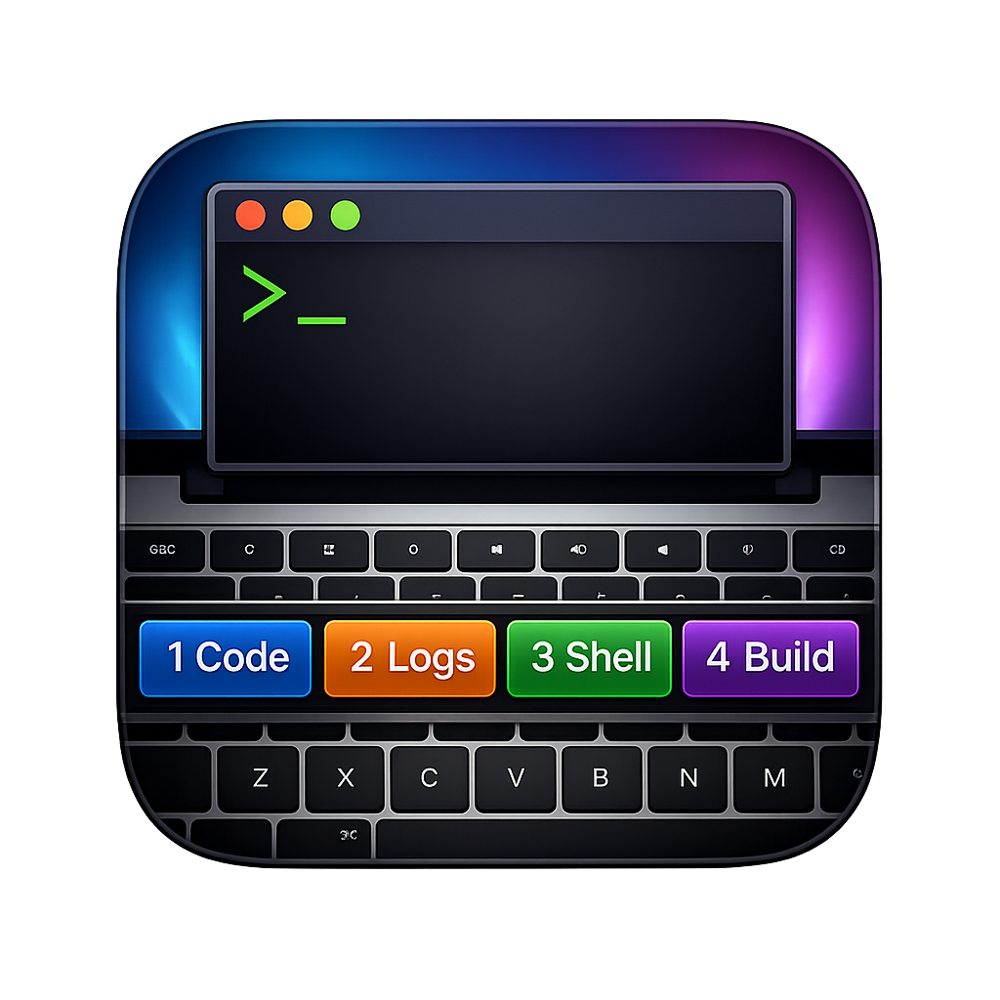

<p align="center">
  
</p>

<h1 align="center">tmux-bar</h1>

<p align="center"><strong>Version 1.1.0</strong></p>

`tmux-bar` is a macOS menu bar app that shows your tmux windows on the Touch Bar and lets you switch windows with one tap.

## Screenshot

<p align="center">
  
</p>

## Features

- Runs quietly from the **menu bar** only (no Dock icon).
- When **Terminal**, **iTerm2**, or **Ghostty** is the frontmost app and you’re in tmux, your **windows appear on the Touch Bar**; tap one to **switch** to that window.
- The **current window** is easy to spot (**brighter colored** outline than the rest).
- Lots of windows? **Swipe** the window row sideways; **+** (new window) and **trash** (delete) stay on the right.
- **+** opens a **new tmux window** in the **same folder** as the shell you’re in.
- **Trash** turns on **delete mode** (buttons show an **✕**); tap a window to **close** it. Delete mode turns **off after each tap** so you don’t remove windows by accident.
- If you switch to another app or tmux isn’t in use, the Touch Bar **goes away** so you don’t see old labels.
- The menu bar title can show your **session name and how many windows** you have while tmux is active.

## Requirements

- macOS 13 or newer.
- Mac hardware with Touch Bar support.
- `tmux` installed (`/opt/homebrew/bin/tmux`, `/usr/local/bin/tmux`, or on `PATH`).
- Apple Clang (Xcode or Command Line Tools), CMake 3.20 or newer.
- Python 3 is required **only** when `Resources/AppIcon.icns` is not present (CMake runs `cmake/gen_app_icon.py` to build the icon from `Resources/AppIcon.source.png`, or a placeholder).

## Supported Terminals

`tmux-bar` refreshes while one of these apps is frontmost:

- Terminal (`com.apple.Terminal`)
- iTerm2 (`com.googlecode.iterm2`)
- Ghostty (`com.mitchellh.ghostty`)

## What’s new in 1.1.0

- **About tmux-bar** in the menu bar menu opens a small About window (layout inspired by Ghostty’s About panel): app icon, a short description, and a **Version** / **Build** / **Commit** block.
- **Build** is the total commit count from git at configure time (`git rev-list --count HEAD`); **Commit** is a short hash (`git rev-parse --short=8 HEAD`). If git metadata is unavailable, sensible placeholders are shown.
- **README** and **GitHub** buttons open this repository; the commit line is a link to that commit on GitHub when a hash is known.

## Build with CMake

Configure and build a Release app bundle (output path shown is for the default Makefile/Ninja generator):

```bash
cmake -S . -B build/release -DCMAKE_BUILD_TYPE=Release
cmake --build build/release --parallel
```

The generated application is `build/release/tmux-bar.app`.

To produce an `arm64`-only binary on Apple Silicon (optional):

```bash
cmake -S . -B build/arm64 -DCMAKE_BUILD_TYPE=Release -DCMAKE_OSX_ARCHITECTURES=arm64
cmake --build build/arm64 --parallel
```

### Universal binary (arm64 + x86_64)

Build each architecture into its own build directory, copy one of the `.app` bundles, then replace the executable with a `lipo` merge (same approach the release workflow uses):

```bash
set -euo pipefail

cmake -S . -B build/arm64 -DCMAKE_BUILD_TYPE=Release -DCMAKE_OSX_ARCHITECTURES=arm64
cmake --build build/arm64 --parallel

cmake -S . -B build/x64 -DCMAKE_BUILD_TYPE=Release -DCMAKE_OSX_ARCHITECTURES=x86_64
cmake --build build/x64 --parallel

APP_NAME="tmux-bar"
UNIVERSAL_DIR="build/universal"
UNIVERSAL_APP="${UNIVERSAL_DIR}/${APP_NAME}.app"
ARM_APP="build/arm64/${APP_NAME}.app"
X64_APP="build/x64/${APP_NAME}.app"

rm -rf "${UNIVERSAL_DIR}"
mkdir -p "${UNIVERSAL_DIR}"
cp -R "${ARM_APP}" "${UNIVERSAL_APP}"

lipo -create \
  "${ARM_APP}/Contents/MacOS/${APP_NAME}" \
  "${X64_APP}/Contents/MacOS/${APP_NAME}" \
  -output "${UNIVERSAL_APP}/Contents/MacOS/${APP_NAME}"

chmod +x "${UNIVERSAL_APP}/Contents/MacOS/${APP_NAME}"
```

Zip the universal bundle for distribution:

```bash
cd build/universal
ditto -c -k --sequesterRsrc --keepParent "tmux-bar.app" "tmux-bar-universal.zip"
```

### App icon

Put your artwork under **`Resources/`** (see `Resources/README.txt`):

| File | What happens |
|------|----------------|
| `Resources/AppIcon.icns` | Used directly in the app bundle (best for a finished icon). No Python step. |
| `Resources/AppIcon.source.png` | At build time, `cmake/gen_app_icon.py` runs `sips` + `iconutil` to build `AppIcon.icns` from your square PNG (1024×1024 is ideal). |
| *(neither)* | A temporary solid-color icon is generated. |

After adding or changing an icon, run **`cmake --build`** on your existing build directory (for example **`cmake --build build/release`**). If CMake does not notice a newly added file, reconfigure with **`cmake -S . -B build/release`** first. Remove **`Resources/AppIcon.icns`** if you want to switch back to building from **`AppIcon.source.png`** or the placeholder.

## Run from Source

After building with CMake, open `build/release/tmux-bar.app` (or your chosen build directory) from Finder, or run the executable inside the bundle from a terminal.

The app appears in the macOS status/menu bar as `tmux-bar`.

## Debug Mode

Set `TMUX_BAR_DEBUG` (to any value) in your run environment to enable:

- More status text in the menu bar.
- A **Log Debug Snapshot** menu action.

## Downloading Releases

Prebuilt binaries are attached to GitHub Releases.

1. Open the [Releases](../../releases) page.
2. Download the `tmux-bar-universal.zip` asset from the latest version.
3. Unzip and move `tmux-bar.app` to `Applications` (or another preferred location).
4. Launch the app.

## Notes

- If no tmux session is available, the Touch Bar buttons are hidden.
- For auto-start at login, add `tmux-bar.app` to macOS Login Items.

## License

MIT License. See [`LICENSE`](LICENSE).
