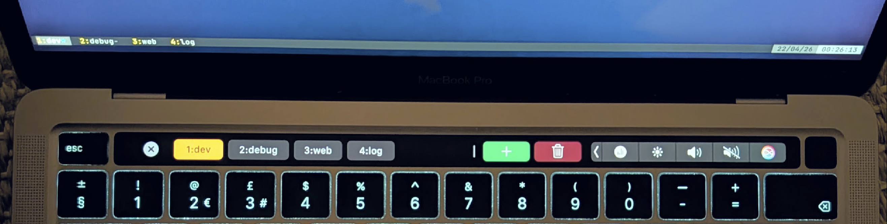

<h1 align="center">tmux-bar</h1>

<p align="center"><strong>Version 1.1.0</strong></p>

`tmux-bar` is a macOS menu bar app that shows your [tmux](https://github.com/tmux/tmux) windows on the Touch Bar and lets you switch windows with one tap.

## Screenshot

<p align="center">
  
</p>

## Features

- Runs quietly from the **menu bar** only (no Dock icon).
- When **Terminal**, **iTerm2**, or **Ghostty** is the frontmost app and you’re in [tmux](https://github.com/tmux/tmux), your **windows appear on the Touch Bar**; tap one to **switch** to that window.
- The **current window** is easy to spot (**brighter colored** outline than the rest).
- Lots of windows? **Swipe** the window row sideways; **+** (new window) and **trash** (delete) stay on the right.
- **+** opens a **new [tmux](https://github.com/tmux/tmux) window** in the **same folder** as the shell you’re in.
- **Trash** turns on **delete mode** (buttons show an **✕**); tap a window to **close** it. Delete mode turns **off after each tap** so you don’t remove windows by accident.
- If you switch to another app or [tmux](https://github.com/tmux/tmux) isn’t in use, the Touch Bar **goes away** so you don’t see old labels.
- The menu bar title can show your **session name and how many windows** you have while [tmux](https://github.com/tmux/tmux) is active.

## Requirements

- macOS 13 or newer.
- A MacBook Pro model with a Touch Bar: 13-inch (2016/2017/2018/2019 Four Thunderbolt 3 Ports, 2020 Two Thunderbolt 3 Ports, 2020 Four Thunderbolt 3 Ports, M1 2020, M2 2022), 15-inch (2016/2017/2018/2019), or 16-inch (2019).
- [tmux](https://github.com/tmux/tmux) installed (`/opt/homebrew/bin/tmux`, `/usr/local/bin/tmux`, or on `PATH`).
- Apple Clang (Xcode or Command Line Tools), CMake 3.20 or newer.

## Supported Terminals

`tmux-bar` refreshes while one of these apps is frontmost:

- Terminal (`com.apple.Terminal`)
- iTerm2 (`com.googlecode.iterm2`)
- Ghostty (`com.mitchellh.ghostty`)

## What’s new in 1.1.0

- **About tmux-bar** in the menu bar menu opens a small About window (layout inspired by Ghostty’s About panel): app icon, a short description, and a **Version** / **Build** / **Commit** block.
- **Build** is the total commit count from git at configure time (`git rev-list --count HEAD`); **Commit** is a short hash (`git rev-parse --short=8 HEAD`). If git metadata is unavailable, sensible placeholders are shown.
- **README** and **GitHub** buttons open this repository; the commit line is a link to that commit on GitHub when a hash is known.

## Build with CMake

Configure and build a Release app bundle (output path shown is for the default Makefile/Ninja generator):

```bash
cmake -S . -B build -DCMAKE_BUILD_TYPE=Release
cmake --build build --parallel
```

The generated application is `build/tmux-bar.app`.

## Run from Source

After building with CMake, open `build/tmux-bar.app` from Finder, or run the executable inside the bundle from a terminal.

The app appears in the macOS status/menu bar as `tmux-bar`.

## Debug Mode

Set `TMUX_BAR_DEBUG` (to any value) in your run environment to enable:

- More status text in the menu bar.
- A **Log Debug Snapshot** menu action.

## Downloading Releases

Prebuilt binaries are attached to GitHub Releases.

1. Open the [Releases](../../releases) page.
2. Download the `tmux-bar-universal.zip` asset from the latest version.
3. Unzip and move `tmux-bar.app` to `Applications` (or another preferred location).
4. Launch the app.

## Notes

- If no [tmux](https://github.com/tmux/tmux) session is available, the Touch Bar buttons are hidden.
- For auto-start at login, add `tmux-bar.app` to macOS Login Items.

## License

MIT License. See [`LICENSE`](LICENSE).
